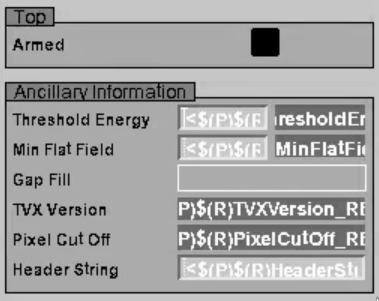

Drivers
=======

The generated header file contains the string parameters, and defines the parameters to
make the interface. In this example we have a header file pilatusDetectorParamSet.h:

.. literalinclude:: ../../tests/produce_format/output/pilatusDetectorParamSet.h
    :language: cpp

The existing pilatus.cpp is then modified to remove these parameters definitions and
use the param set API.

Database Template File
----------------------

According to the demand and readback properties of the component, the following
records are created:

.. literalinclude:: ../../tests/produce_format/output/pilatusParameters.template

The top level pilatus.template includes this file, as well as records that
provide logic (for things like the arrayRate and EPICSShutter in areaDetector).

UI
--

Finally, UI elements can be generated for each component for multiple graphical
applications. For example, the following EDM screen is generated:

This can serve as a low level overview of the entire system, as well as a convenient
pallette for constructing higher level, more structured screens.

Ongoing Development
-------------------

Once a module is working with PVI (either an existing module after the YAML is created
from the templates using the one time generation script, or a newly written module) it
will then be necessary to update the YAML file in future development. Here is an
example of necessary changes to add a new parameter, with and without
PVI:

With PVI
~~~~~~~~

Update YAML file:

.. code-block:: YAML

      - type: AsynFloat64
        name: DelayTime
        description: Delay in seconds between the external trigger and the start of image acquisition
        role: Setting
        initial: 0
        record_fields:
          PREC: 3
          EGU: s

And then run pvi (or possibly just make, if it is integrated into a Makefile). It can
then be shared with other sites who can generate their own required files.

Without PVI
~~~~~~~~~~~

Update template:

.. code-block:: cpp

    # Delay time in External Trigger mode.
    record(ao, "$(P)$(R)DelayTime")
    {
        field(PINI, "YES")
        field(DTYP, "asynFloat64")
        field(OUT,  "@asyn($(PORT),$(ADDR),$(TIMEOUT))DELAY_TIME")
        field(EGU,  "s")
        field(VAL,  "0")
        field(PREC, "6")
    }

    record(ai, "$(P)$(R)DelayTime_RBV")
    {
        field(DTYP, "asynFloat64")
        field(INP,  "@asyn($(PORT),$(ADDR),$(TIMEOUT))DELAY_TIME")
        field(EGU,  "s")
        field(PREC, "6")
        field(SCAN, "I/O Intr")
    }

Update header file:

.. code-block:: cpp

    ...
    #define PilatusDelayTimeString "DELAY_TIME"
    ...
    createParam(PilatusDelayTimeString, asynParamFloat64, &PilatusDelayTime);
    ...
    int PilatusDelayTime;
    ...

Update docs:

.. code-block:: rst

  * - Delay in seconds between the external trigger and the start of image acquisition
    - DELAY_TIME
    - $(P)$(R)DelayTime
    - ao

Update screens (of course, this will actually involve editing with a graphical
interface):

.. code-block:: javascript

    "text update" {
        object {
            x=604
            y=146
            width=80
            height=18
        }
        monitor {
            chan="$(P)$(R)DelayTime_RBV"
            clr=54
            bclr=4
        }
        align="horiz. centered"
        limits {
        }
    }
    "text entry" {
        object {
            x=540
            y=145
            width=59
            height=20
        }
        control {
            chan="$(P)$(R)DelayTime"
            clr=14
            bclr=51
        }
        limits {
        }
    }
    text {
        object {
            x=435
            y=145
            width=100
            height=20
        }
        "basic attribute" {
            clr=14
        }
        textix="Delay time"
        align="horiz. right"
    }

Then either add equivalent changes to other screen types or use autoconvert, if
available, and add any site specific details to any of these files (such as autosave
and archiver tags).

Class Hierarchy
---------------

Drivers will access their parameters via a param set, either using inheritance or
composition. The class hierarchy for param sets mirrors the drivers. Each of the 'base'
classes (classes not instantiated directly) has-a paramSet containing its parameters in
addition to its parent class(es). The most derived classes inherit their param sets
so that they have direct access to all parameter indexes (and so that the source code
does not have to change to insert ``paramSet->`` to access them).

There is a new method ``asynPortDriver::createParams`` that iterates the member vector
of ``asynParamSet`` storing parameter definitions and calls
``asynPortDriver::createParam`` (no 's') on each of them. If the vector is empty
(i.e. if it only has the default ``asynParamSet`` and not a specific implementation)
it has no effect. This means ``asynPortDriver`` can be inherited from as before with
no change.

Virtual inheritance is required for two reasons. Primarily, it ensures only a single
instance of ``asynParamSet`` is created and it is shared throughout the class
hierarchy to ensure asynPortDriver can find the child parameters. It also means that
the most derived class must call the constructors for all virtual base classes before
the non-virtual base classes. This means the constructors are called in the correct
order such that when the asynPortDriver constructor the ``asynParamSet``
``parameterDefinitions`` is fully populated when ``createParams`` is called.

Change Summary
~~~~~~~~~~~~~~

    * asyn - https://github.com/dls-controls/asyn/tree/pvi
        * Created ``asynParamSet``
        * New overloaded asynPortDriver constructor that takes an ``asynParamSet*``
          and calls createParams()

    * ADCore - https://github.com/dls-controls/ADCore/tree/pvi
        * ``asynNDArrayDriver`` parameters split into ``asynNDArrayDriverParamSet``
            Constructor updated to take an ``asynNDArrayDriverParamSet*``.
            Updated to access parameters via ``paramSet->``
        * ``ADDriver`` parameters split into ``ADDriverParamSet``
            Constructor updated to take an ``ADDriverParamSet*``.
            Updated to access parameters via ``paramSet->``
        * ``NDPluginDriver`` inherits ``asynNDArrayDriverParamSet`` in addition to ``asynNDArrayDriver``
            Updated to access parameters via ``paramSet->``.
            Child classes work with no changes
        * Some trivial updates to the tests

    * ADSimDetector - https://github.com/dls-controls/ADSimDetector/tree/pvi
        * ``simDetector`` parameters split into ``simDetectorParamSet``
        * ``simDetector`` inherits from ``simDetectorParamSet`` in addition to
          ``ADDriver``
        * Can access parameters as before

    * ADPilatus - https://github.com/dls-controls/ADPilatus/tree/pvi
        * Equivalent to ADSimDetector changes

    * motor - https://github.com/dls-controls/motor/tree/pvi
        * ``asynMotorController`` parameters split into ``asynMotorControllerParamSet``
        * Updated to access parameters via ``paramSet->``

    * pmac - https://github.com/dls-controls/pmac/tree/pvi
        * ``pmacController`` parameters split into ``pmacControllerParamSet``
        * ``pmacCSController`` same
        * Each inherit from their own param set (which inherits
          ``asynMotorControllerParamSet``) in addition to ``asynMotorController``
        * Can access parameters as before

Caveats
~~~~~~~

There are some changes that are unavoidable without inserting edge cases into the
generation logic and making the YAML schema more complicated. Some examples are:

    1. The first param index used for calling base class methods is inconsistently
       named, so we will have to agree a consistent way to generate them and make them
       the same.
    2. Any readback parameters will have an _RBV suffix added. Some existing readbacks
       do not have this, e.g. Armed in pilatusDetector.
    3. FIRST_DRIVER_PARAM needs to be defined in the main header file based on the
       FIRST_DRIVER_PARAM_INDEX defined in the param set header file, appending
       ``paramSet->`` or not depending on whether it inherits the param set or not. (This
       could possibly be handled in a better way by adding more logic to the
       ``asynParamSet`` - see `Possible Further Work`_)
    4. Asyn parameter names will be the same as the name of the index variable. The
       value can be overridden to define drvInfo for drvUserCreate dynamic parameters.

Next Steps
~~~~~~~~~~

A script is in development to perform the generation of an initial YAML file from a
template. The idea being that after this point, everything is generated from the YAML
file and any changes are made there and everything regenerated. New drivers can use
a YAML file from the start.

The current hierarchy (base classes have-a param set while the most derived class
is-a param set) is inconsistent and confusing, but it has the benefit that people are
not forced to change drivers inheriting from these base classes to access parameters
via ``paramSet->``, they just need to inherit the parent param set. It also means that
the most derived classes cannot be inherited from alongside an extended param set
(this is not necessarily a problem, but it seems like an unnecessary restriction).
It would be clearer to remove this and require all child classes to use the param set
explicitly, removing the need for virtual inheritance. This would just need an addition
to the extern C calls to create the param set and pass it into the constructor of the
driver. Another option is to create a class that inherits from the driver and the param
set, with no additional logic. This could then instantiate the param set and pass it to
the driver constructor. Either solution would resolve caveat 3, because all classes
will access FIRST_DRIVER_PARAM via ``paramSet->``.

Possible Further Work
~~~~~~~~~~~~~~~~~~~~~

Adopting this framework could make it easier to make other improvements to the C++ code,
such as:

    * Move some asynPortDriver functionality into ``asynParamSet`` / ``asynParam`` (See ADEiger eigerParam)
        * Reduce the size of ``asynPortDriver``
        * Possibility of typed subclasses of ``asynParam`` to reduce if statements for
          handling the many ``asynParamType`` values in slightly different ways
    * Simplify the sharing of file writing functionality between some drivers
        * ADPilatus and NDPluginFile-derived classes - Parameters could be split out
          of ``asynNDArrayDriver`` into a ``FileWriterParamSet``, which could then be
          included via composition only where required, rather than every driver and
          plugin under ``asynNDArrayDriver`` having these parameters.

